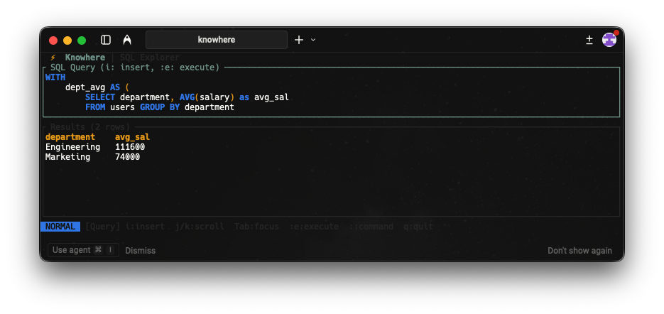

# TUI Overview

Knowhere provides a Vim-style terminal interface for querying data files.


*Terminal interface showing query editor and results table*

## Features

- **Vim-style navigation** - Familiar keybindings for Vim users
- **Split-pane layout** - Query editor and results side by side
- **Result scrolling** - Navigate large result sets
- **Multiple formats** - CSV, Parquet, Delta Lake, SQLite

## Usage

```bash
# Single file
knowhere data.csv
knowhere sales.parquet

# Directory (each file becomes a table)
knowhere ./data-folder/

# SQLite database
knowhere database.db

# Non-interactive mode
knowhere --query "SELECT * FROM data" data.csv
```

## Output Formats

```bash
# Table format (default in TUI)
knowhere --query "SELECT * FROM data" --format table data.csv

# CSV output
knowhere --query "SELECT * FROM data" --format csv data.csv

# JSON output
knowhere --query "SELECT * FROM data" --format json data.csv
```
